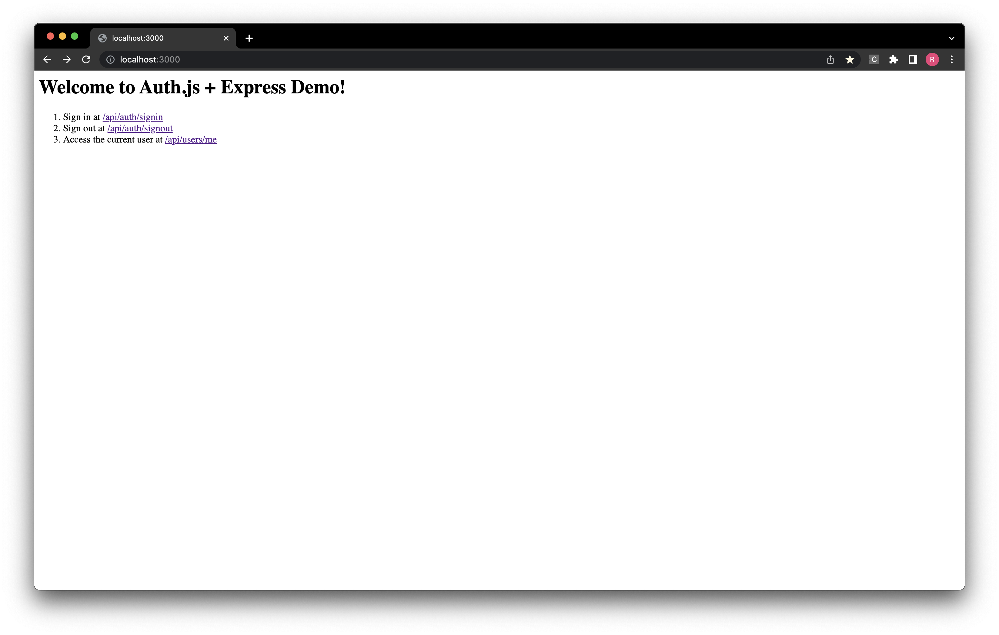

# authjs-express-demo

This demo show-cases an approach to using Auth.js (formerly NextAuth) in an Express backend.



# Development

NB: This demo requires Node 19+ which has support for global `crypto` and `fetch` APIs relied on by Auth.js' `@auth/core`, OR execution with `--experimental-global-webcrypto` and `--experimental-fetch` flags.

1. Install dependencies with
   ```bash
   pnpm install
   ```
   > The project uses `pnpm` but you can also install dependencies with `npm` or `yarn`
2. Run the development server

   ```bash
   pnpm dev
   ```

   OR start a server with experimental flags script:

   ```bash
   pnpm build
   pnpm start
   ```

# How It Works

Auth.js, previously NextAuth, provides a `@auth/core` package that works across different node frameworks.

However, it is built on top of `fetch`-API's Request and Response objects.

This means that we have to perform conversion between Express's HTTP based Request and Response objects to the Fetch API equivalents.

The process is as follows:

1. Convert the incoming Express request to the route to a Fetch API Request
2. Pass the request (and authentication config) to `Auth()` from Auth.js for handling
3. Get the returned Fetch API Response, and convert to an Express response

The conversion logic that makes this demo possible is found in [`httpApiAdapters.ts`](./src/utils/httpApiAdapters.ts).

# Acknowledgements

- [next-auth-express-demo](https://github.com/rexfordessilfie/next-auth-express-demo) for Express app setup.
- [authjs-node-example](https://github.com/jibla/authjs-node-example) for TS configuration and working example.
